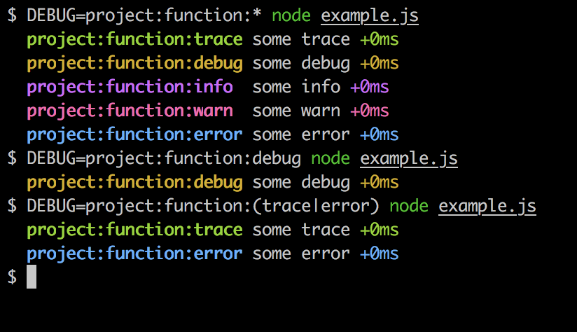

# debug-with-levels

Adds output levels to debug's output but doesn't enforce a level hierarchy and uses the same mechanism as debug for turning levels on and off.

_(Requires node >=10.0.0)_

## Install

```bash
npm install debug-with-levels --save
```

## Usage

See debug package for DEBUG environment variable examples and message formatting: https://www.npmjs.com/package/debug

```js

const log = require('.')('project:function')

log.trace('hello') // project:function:trace hello +0ms
log.debug('hello') // project:function:debug hello +0ms
log.info('hello')  // project:function:info  hello +0ms
log.warn('hello')  // project:function:warn  hello +0ms
log.error('hello') // project:function:error hello +0ms

```

Examples mixing and matching the levels.

<kbd></kbd>

## Run Tests

```bash
npm install
npm test
```
